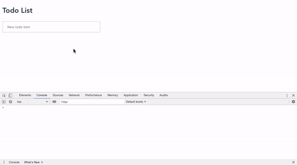

## Todo list (Vue.js, Express, Node.js, MongoDB)
\
Everything is set up on the localhost.

### DB
`docker container run -p 127.0.0.1:27017:27017 --name mongodb  -t mongo`

### Dockerization (not working yet)
`docker pull mongo`\
`docker-compose up --build`